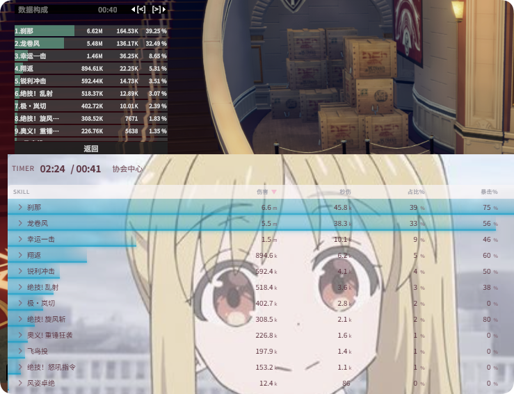

# DPS Meter

Real-time damage statistics, history, and custom column settings.

## Overview

The DPS Meter parses combat data via network packet capture, supporting:

- **Real-time statistics**: Instant updates of damage, DPS, etc. during combat
- **History**: Saves past combat encounters
- **Multi-dimensional data**: Damage, healing, damage taken (DPS / HPS / TPS)

---

## Data Metrics

### Skill Breakdown

The DPS skill breakdown follows the client's built-in DPS logic: each skill may have multiple damage sources, and each damage instance is assembled into a **damage ID** using fixed rules, then aggregated into a single skill for display. As a result, expanding some skills will reveal multiple sub-entries.

Brief explanation of the aggregation rules:

1. **Raw damage entries**: Each hit corresponds to one record, containing the skill ID, damage source, hit event ID, etc.
2. **Aggregated display**: Entries with the same damage ID are merged into a single "skill" display; expanding it reveals the individual sub-entries under that skill

### True DPS and Active Combat Time

- **DPS**: Calculated using the total wall-clock time of the entire encounter
- **True DPS**: Calculated using only the "active time during which actual damage occurred"

In **DPS Meter > Theme > Real-time > Timer**, check "Show active combat time" to display the active time.

### Healing / Damage Taken Columns

Healing and damage taken modes use a similar column structure, tracking HPS (healing per second), TPS (damage taken per second), and related metrics such as critical hits, lucky hits, etc.

---

## Reset Logic

Combat statistics are split and reset according to the following rules:

| Scenario | Behavior |
|----------|----------|
| **Master dungeons** | Automatically split into trash mobs and boss; history shows 2 entries: one for trash, one for boss |
| **Raids** | Each boss is split independently; each boss corresponds to one history entry |
| **Wipe** | Statistics are automatically reset on wipe |

Resets within the same scenario are triggered automatically on the next attack:

- **Master dungeons**: After clearing trash mobs, statistics reset automatically when you first attack the boss; the boss phase is tracked separately
- **Raids**: Statistics reset automatically when you attack a new boss
- **After a wipe**: Statistics reset automatically when you next attack the boss

---

## Theme & Customization

The DPS interface is **highly customizable** via **DPS Meter > Theme**.

- **Color themes**: Multiple presets available (dark, light, pink, green, matcha, rainbow, etc.), plus full custom color options
- **Size & layout**: Adjust table, header, font size, padding, etc.
- **Timer & buttons**: Choose whether to display active combat time, reset/pause/boss filter buttons
- **Column visibility & sorting**: Check or hide various metrics in the player/skill columns

By combining presets and custom settings, you can create a personalized DPS display style.

---

## Settings Reference

| Setting | Path |
|---------|------|
| Player column display | DPS Meter > Settings > Real-time > DPS (Player) Columns |
| Skill column display | DPS Meter > Settings > Real-time > DPS (Skill) Columns |
| Refresh rate | DPS Meter > Settings > Real-time > Refresh Rate (50--2000 ms) |
| Abbreviate DPS values | DPS Meter > Settings > Real-time > Abbreviate DPS Values (e.g., 5k, 50k) |
| Active combat time | DPS Meter > Theme > Real-time > Timer > Show Active Combat Time |
| Network capture method | DPS Meter > Settings > Network |
| Hotkeys | DPS Meter > Settings > Hotkeys |

---

## History

History provides more comprehensive and detailed review data compared to real-time statistics, including:

- **Damage breakdown per target**: Damage from each skill split by target (boss, adds, etc.)
- **Skill distribution details**: Expand to see multiple damage sources under each skill
- **Full combat data**: Summary statistics for the entire encounter

- When history exceeds 200 entries, the next time the application starts it will automatically clean up older entries by time and reset the sequence, so there is no need to manually maintain history data.
