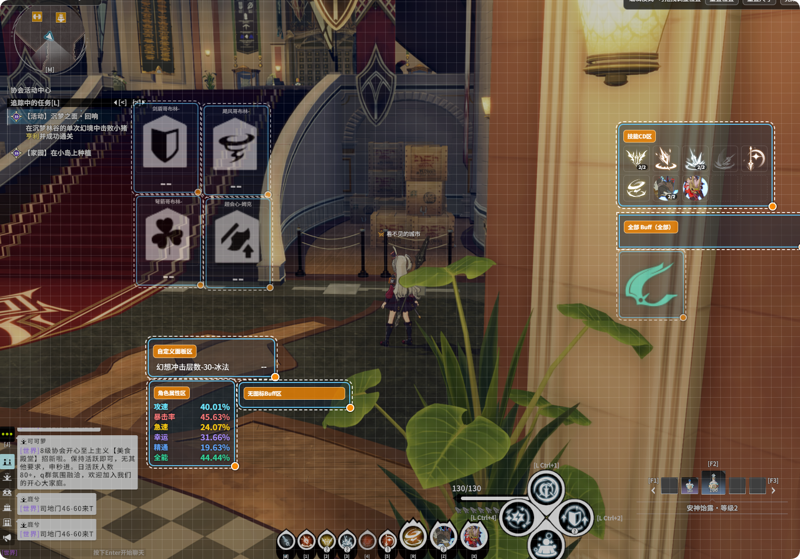

# Buff Monitor

Skill CD, buff tracking, custom panel, and related feature documentation.

## Overview

Real-time monitoring is divided into the following sections:

- **Skill CD**: Monitor skill cooldowns
- **Buff Monitor**: Track specified buffs' duration, stacks, etc.
- **Character Panel**: Display stats such as attack speed, crit rate, intelligence, etc.
- **Custom Panel**: Show counters and buffs in a progress bar format
- **Enable Window**: Overlay display and layout

> **Warning -- Opening the app mid-game**: If you open this application while the game is already in progress, Skill CD, character panel stats, etc. may be incomplete. This is because the game only sends **incremental updates**, and the app cannot retrieve the full current state. Solution: **change zones** (switch scene/map) once to trigger a full state sync, and the display will return to normal.
>

---

## Skill CD

- After selecting a class, check the skills you want to monitor
- Real-time display of skill cooldown status and remaining time
- Supports switching presets by class

### Skill Transformation

Some skills transform into a different form when a specific buff is active. The Skill CD display will automatically switch the icon and name based on the current buff state. For example, Wind Knight's "Bird Toss" displays as "Ultimate: Storm Slash" when a specific buff is active; Frostmage's "Blizzard" displays as "Instant-cast Blizzard" when the cast-skip buff is active.

---

## Buff Monitor

### Standalone Mode / Group Mode

- **Standalone mode**: Each buff is displayed individually; icon size and position can be set independently

- **Group mode**: Multiple buffs are grouped together with a unified layout

### Special Buffs

Some buffs change their display based on **stack count** (e.g., different icons for 1 stack vs. 2 stacks). These are called special buffs. No extra configuration is needed -- just add them to the monitoring list like any regular buff, and the overlay will automatically switch icons based on the stack count.

**How to use:**

1. In **Real-time Monitor > Buff Monitor**, add the target buff to the monitoring list (you can search by buff name)
2. If the buff is configured as a special buff, the icon will change automatically based on stack count -- no additional setup required

**Currently supported special buffs:**

| Class | Buff Name | Effect Description |
|-------|-----------|-------------------|
| Wind Knight | Pursuit Stance | 1 stack shows a single icon; 2 stacks shows a dual icon combo, making it easy to distinguish stack states |

### Buff Aliases

Some in-game buff names are not intuitive. You can rename them in **Buff Monitor > Buff Alias Settings**:

- Search for the original name (e.g., `[Zeal]`)
- Set a display name (e.g., "Life Fluctuation")

Aliases **apply globally** and are not affected by preset switching.

### How to quickly find a buff to monitor?

Since buff configuration names can be confusing, if you are unsure of the exact name of the target buff, you can first enable "Monitor All" in **group mode** for a group. Once the overlay displays all buffs, identify the correct name based on the actual effect, then add it to the precise monitoring list.

### Category Quick Monitor

- **Food**: Monitor all food buffs at once
- **Alchemy**: Monitor all alchemy buffs at once

Use this in **Buff Monitor > Category Quick Monitor**, or use the shortcut buttons in group mode.

### Buff Priority

You can set display priority for buffs in limited space, ensuring important buffs are shown first.

### Buffs Without Icons

Buffs without icons are displayed as progress bars on a single line. Their **name color**, **value color**, and **progress bar color** are all customizable. Settings path: **Real-time Monitor > Buff Monitor**.

---

## Custom Panel

Display counters or buffs in a **progress bar** format, suitable for buffs without icons or scenarios requiring a unified layout.

Progress bar and text appearance are fully customizable:

- **Custom Panel** (counters, buff progress bars): Row spacing, font size, name-to-value spacing, as well as **name color**, **value color**, and **progress bar color**

All options above are configured in **Real-time Monitor > Custom Panel**.

### Counters

Supports a state machine that links buffs and damage types, used to count special triggers not maintained as buffs, such as:

- Phantasm Impact count
- Transcendence trigger count

Configure in **Real-time Monitor > Custom Panel > Add Counter**.

---

## Layout & Display

### Overlay Position

All modules (Skill CD, resources, buff panel, character panel, custom panel) can be dragged to adjust position.

### Display Format

- Buff duration supports "grouped" and "hours" formats
- You can choose whether to display name, remaining time, and stack count

---

## Best Practices

After configuration is complete, it is recommended to press **`Ctrl+\`** to enter **UI-free mode**: the main interface is minimized, leaving only the overlay displaying Skill CD, resources, buffs, etc. Position the overlay at the screen edge or in your peripheral vision -- even on a large screen, you can monitor cooldowns and resources at a glance without looking away.

---

## Presets

- Different classes/playstyles can have different **presets**
- Each preset can have independent Skill CD, buff monitoring, layout, etc.
- Switching presets switches the entire monitoring configuration
